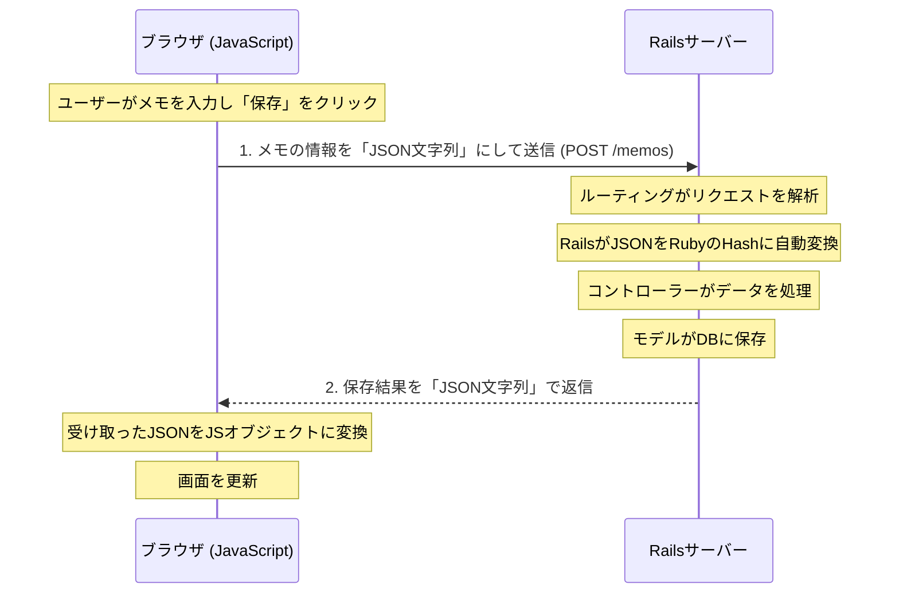

# RailsとJavaScript間のデータフロー完全解説 (JSON編)    2026. 7/20. ②

このドキュメントは、JavaScript（ブラウザ）から入力されたデータが、Rails（サーバー）に保存され、その結果が再びブラウザに反映されるまでの一連の流れを、ステップバイステップで解説します。

## 全体像：ブラウザとサーバーのキャッチボール

データの流れは、ブラウザとサーバー間での「JSON」という共通言語を使った情報のキャッチボールに例えることができます。



それでは、各ステップを詳しく見ていきましょう。

---

## 【ステップ1〜2】ブラウザからサーバーへ：データを送る

### ① JavaScriptオブジェクトをJSON文字列に変換

まず、ブラウザ上でユーザーが入力したタイトルと本文を、JavaScriptのオブジェクトとしてまとめます。

```javascript
// memo_saving.js
const memoData = {
  memo: {
    title: title_input.value,   // "あいうえお"
    content: body_input.value,  // "あいうえお"
  },
};
```

次に、このJavaScriptオブジェクトを `JSON.stringify()` を使って、サーバーに送れるただの**文字列**に変換します。

```javascript
// memo_saving.js
const jsonString = JSON.stringify(memoData);
// jsonString の中身: '{"memo":{"title":"あいうえお","content":"あいうえお"}}'
```

### ② `fetch`でHTTPリクエストとして送信

変換したJSON文字列を`body`に詰めて、`fetch` APIを使ってサーバーに送信します。このとき、「これから送るデータはJSON形式ですよ」と伝えるために、`Content-Type: 'application/json'`というヘッダーを付けます。

```javascript
// memo_saving.js
fetch('/memos', {
  method: 'POST',
  headers: {
    'Content-Type': 'application/json',
    'X-CSRF-Token': csrfToken,
  },
  body: jsonString, // ここに先ほどの文字列が入る
});
```

---

## 【ステップ3〜6】サーバー側の処理：データを受け取り、保存する

### ③ ルーティング (`routes.rb`)

サーバーに届いたリクエストを、まずルーターが受け取ります。ルーターはリクエストの**「行き先」**だけを見て、担当のコントローラーに処理を振り分けます。

*   **リクエスト:** `POST /memos`
*   **行き先:** `MemosController` の `create` アクション

> **ポイント:** ルーティングはリクエストの`body`（JSON文字列の中身）を一切見ません。あくまでURLとHTTPメソッドの組み合わせだけを見ています。

### ④ Railsによる自動変換

コントローラーが動く直前に、Railsが `Content-Type: 'application/json'` ヘッダーを認識し、リクエストの`body`に入っているJSON文字列を、自動的にRubyの**Hash**に変換して `params` に格納します。

```ruby
# サーバーログに表示される params
params # => {"memo"=>{"title"=>"あいうえお", "content"=>"あいうえお"}}
```

### ⑤ ストロングパラメータ (`memos_controller.rb`)

セキュリティのため、`params` をそのまま使わず、`permit` で許可したキーだけを取り出します。これを**ストロングパラメータ**と呼びます。

### ⑥ モデルでDBに保存

安全なデータ (`memo_params`) を使って `Memo` モデルのインスタンスを作成し、`.save` メソッドでデータベースに保存します。

---

## 【ステップ7〜8】サーバーからブラウザへ：結果を返す

### ⑦ RubyオブジェクトをJSON文字列に変換して返信

データベースに保存された `memo` オブジェクト（Rubyのオブジェクト）を、`render json: memo` を使って再び**JSON文字列**に変換し、ブラウザに返します。

### ⑧ JSON文字列をJavaScriptオブジェクトに戻す

ブラウザ側では、受け取ったレスポンスに対して `.json()` メソッドを呼び出します。これにより、サーバーから送られてきたJSON文字列が、再びJavaScriptのオブジェクトに変換されます。

```javascript
// memo_saving.js
.then(response => response.json()) // ここで変換
.then(savedMemo => {
  // savedMemo はJSオブジェクトなので、プロパティにアクセスできる
  console.log(savedMemo.title);
});
```

この `savedMemo` オブジェクトを使って、画面に新しいメモのアイコンを追加するなどのDOM操作を行います。

---

## まとめ

*   データのやり取りは、**JSON文字列**という共通フォーマットで行われる。
*   **JSオブジェクト ⇄ JSON文字列** の変換は、ブラウザとサーバーの両方で行われる。
*   **ルーティング**は、データの中身ではなく「行き先」を判断する交通整理役。
*   Railsは、JSON文字列をRubyのHashに**自動で**変換してくれる。