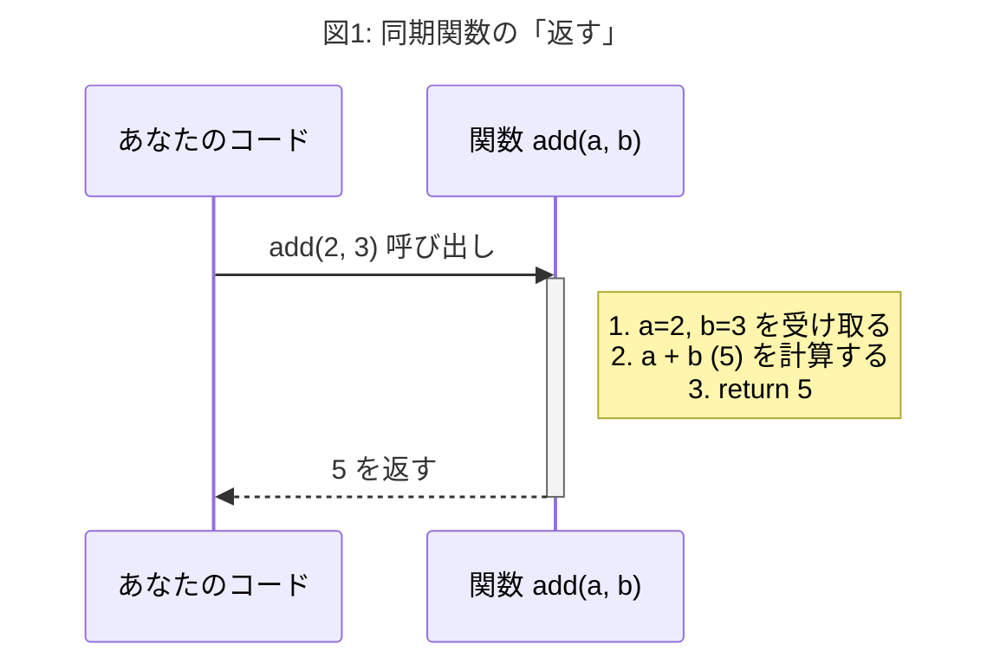
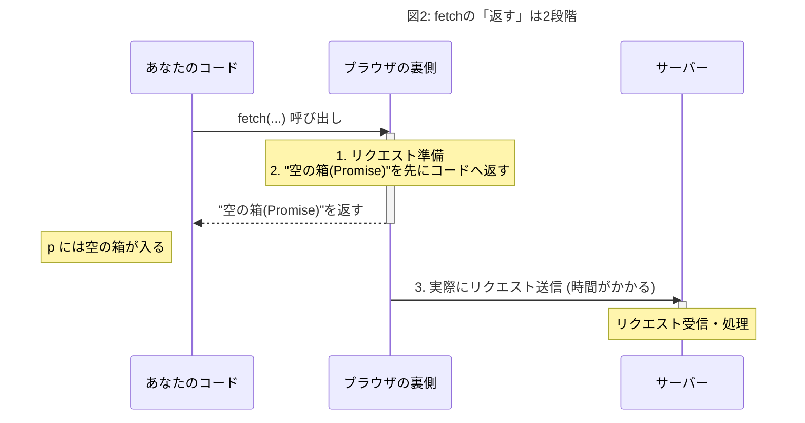
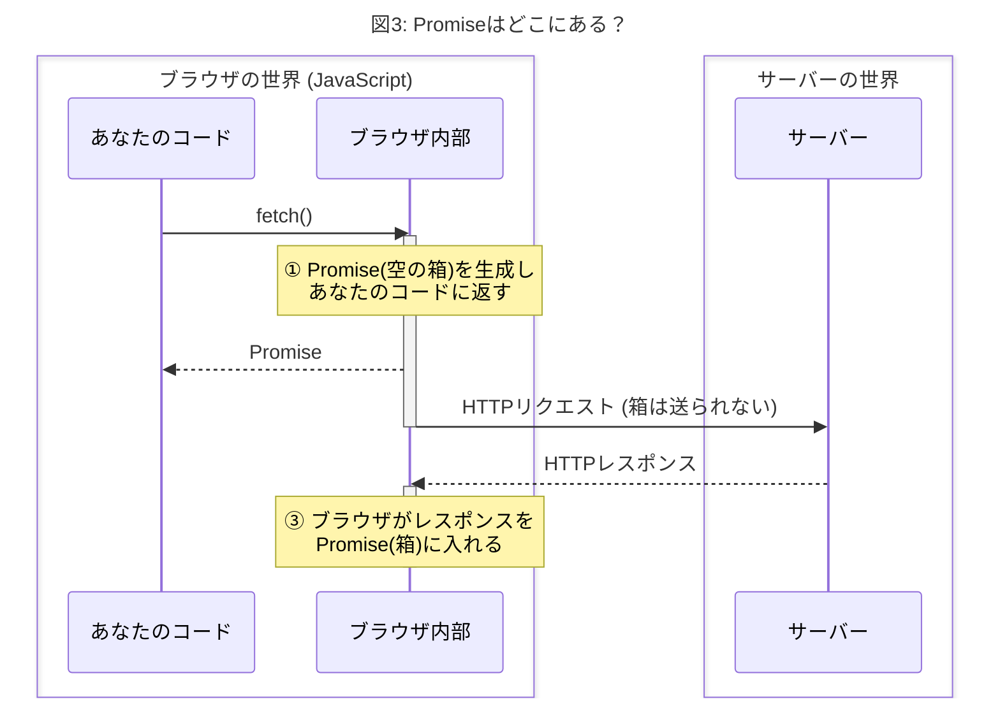
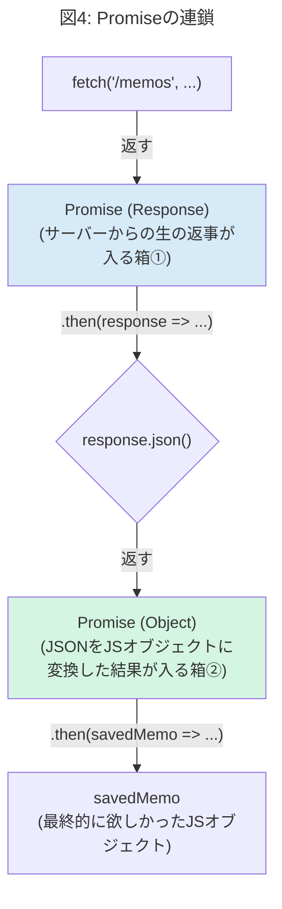
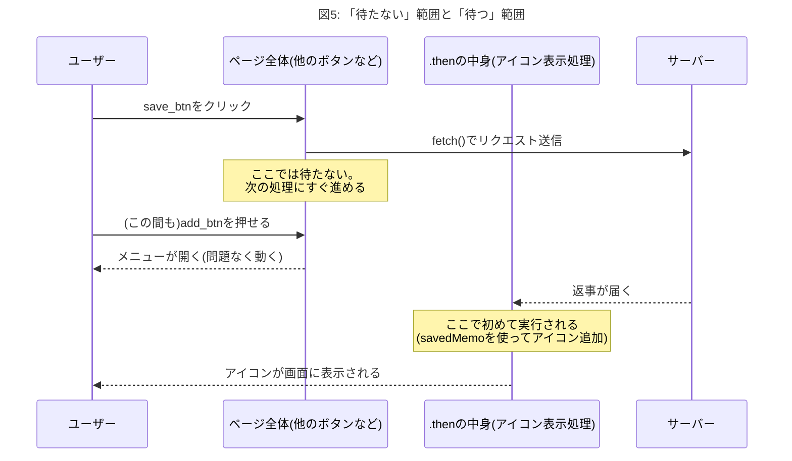

# 【図解】fetch, Promise, thenを完全理解！「返す」の謎を解き明かす  2026.07/20. ④

JavaScriptの`fetch`を使った非同期通信は非常に強力ですが、「`Promise`って何？」「サーバーにデータを**渡す**のになんで値を**返す**の？」といった疑問は、誰もが一度は通る道です。

このドキュメントでは、これらの疑問を一つずつ、図を使いながら根本的に解決していきます。

---

## Part 1: 基本のキ - 「関数が値を返す」とは？

`fetch`の話の前に、JavaScriptの基本である「関数の戻り値」を思い出してみましょう。

```javascript
function add(a, b) {
  return a + b;
}

const result = add(2, 3); // add(2, 3) を実行

console.log(result); // 5 が表示される
```

`add(2, 3)`を実行すると、その**処理が完了し**、`return`で指定された値（この場合は`5`）がその場に返ってきます。`add(2, 3)`という記述が、まるで`5`という数値そのものであるかのように扱われ、`result`変数に代入されます。

これが「関数が値を返す」という言葉の基本的な意味です。サーバーも通信も関係ありません。



結果: add(2, 3) と書いた場所が、計算結果の 5 に置き換わる。

---

## Part 2: `fetch`の特殊事情 - なぜすぐ「箱」を返すのか？

`fetch`も関数なので、呼び出されると値を返します。しかし、`add`関数とは決定的な違いがあります。

- **`add`関数**: 計算は一瞬で終わる。すぐに答えが出せる。
- **`fetch`関数**: サーバーとの通信には時間がかかる。**すぐに答えは出せない。**

JavaScriptは「待ち時間」が嫌いです。サーバーからの返事を待っている間、プログラム全体が停止してしまうと、画面が固まってしまいます。

そこで`fetch`は、賢い方法をとります。

1.  **裏で**サーバーへのリクエスト送信を開始する。
2.  それと**同時に**、呼び出し元には「今は空っぽだけど、未来にサーバーからの返事がここに入る予定の**特別な箱**」を**即座に**返しておく。

この「未来の結果が入る特別な箱」こそが **Promise** です。

```javascript
const promiseBox = fetch('/memos', { ... });

console.log(promiseBox); // Promise {<pending>} と表示される
```

`fetch`を実行した瞬間、`promiseBox`には「サーバーからの返事そのもの」ではなく、「返事を受け取るための予約券」や「空の箱」のようなものである`Promise`オブジェクトが入ります。



**重要なポイント:**
`fetch`は「サーバーにデータを**渡す**」という仕事と、「呼び出し元のコードに`Promise`（空の箱）を**返す**」という仕事を**同時に**行います。この2つは向きが全く違う、別々の動作です。

---

## Part 3: Promiseはブラウザの中だけの仕組み

「結果を受け取る用の箱(Promise)をサーバーに渡すの？」という疑問がよくありますが、答えは**No**です。

**サーバーは`Promise`の存在を一切知りません。**

`Promise`は、サーバーからの返事を待っている間、JavaScriptのコードが迷子にならないようにするための、**ブラウザ（JavaScript実行環境）内部だけの仕組み**です。

サーバーとのやり取りは、昔ながらの単純なHTTP通信だけです。



1. `fetch`を呼ぶと、ブラウザが**あなたのコードのため**に`Promise`（箱）を1つ作ります。
2. サーバーに送られるのは、ただのHTTPリクエストです。**箱は送られません。**
3. サーバーから返事が来たら、**ブラウザが**、先ほど作った箱にその返事を入れます。

---

## Part 4: `.then()` で箱の中身を受け取る

では、空の箱に中身が入ったことをどうやって知るのでしょうか？
そこで登場するのが `.then()` です。

`.then()` は、`Promise`オブジェクト専用のメソッドで、「この箱に中身が入ったら、この関数を実行してください」という**予約**をするためのものです。

```javascript
fetch('/memos', { ... })
  .then(response => {
    // この中は、サーバーから返事が来て、箱に詰められた後に実行される
  });
```

### `response` と `response.json()`

`.then()` の中に渡される `response` は、まだ「メモのデータそのもの」ではありません。これはサーバーからの返事（HTTPレスポンス）全体を表現するオブジェクトで、ステータスコード(`200 OK`など)やヘッダー情報を含んでいます。

本当に欲しいデータ本体（JSON形式の文字列）は、`response`の`body`に入っています。これを取り出して、JavaScriptのオブジェクトに変換する作業が必要です。

そのためのメソッドが `response.json()` です。

しかし、ここにも一つ罠があります。`body`の読み込みも一瞬では終わらない可能性があるため、**`response.json()`もまた、新しい`Promise`（第2の箱）を返す**のです！



この「Promiseの連鎖」を理解することが、`then`を2回つなげる理由を解明するカギです。

1.  最初の`.then()`は、**通信の完了**を待つ。
2.  2番目の`.then()`は、**JSONの解析完了**を待つ。

こうして、`savedMemo`という変数に、晴れてサーバーから送られてきたメモのデータがJavaScriptオブジェクトとして手に入るのです。

---

## Part 5: 結局、なぜPromiseを返すとプログラムが固まらずに済むのか

この解説の出発点だった疑問に、ここで正面から答えます。

> Promiseをコードに返すことで、なぜサーバーからの返事を待っている間プログラムが固まらずに済むのか？

**答え: `fetch`が返事を待たずに、その場ですぐPromise(箱)を返して処理を終わらせるからです。** サーバーへの通信という「時間がかかる部分」を`.then(...)`の中に隔離しておくことで、`.then`の**外側**にあるコード(ページ全体、他のボタンの処理など)は、その通信を待たずにそのまま動き続けられます。これが「固まらない」の正体です。

ここまでで「`fetch`は待たない」と説明してきましたが、これだと1つ新しい疑問が出てきます。

> 保存処理(表示に必要なサーバーの返事)を待たないと、そもそも「表示する」という次の処理に進めないはずなのに、「待たない」ってどういうことだ？

これは正しい疑問です。**「メモを表示する」という処理自体は、サーバーの返事が届くまで絶対に先に進められません。** ここに待たない道はありません。それをすっ飛ばして表示することはできない、というのはその通りです。

では「待たない」とは何の話だったのか。それは**「メモの表示」とは無関係な、他のJavaScriptの処理**の話です。

`fetch`を呼んだ時、JavaScript全体が「サーバーの返事が来るまで、他の処理も含めて何もかも一時停止する」というやり方を取ってしまうと、返事を待つ数百ミリ秒〜数秒の間、アプリ全体(他のボタンや他の機能)が固まって使えなくなります。それを避けるために、「サーバーの返事を使う処理(メモの表示)」だけを`.then`の中に隔離して**後回し**にし、それ以外の無関係な処理(他のボタンなど)は待たせずにそのまま動かし続ける、というのが実態です。

つまり「待たない」は、「メモの表示処理が待たずに終わる」という意味ではなく、「メモの表示処理を待っている間も、それとは無関係な他の処理まで一緒に止めることはしない」という意味です。

- **待たない部分**: `.then(...)`の**外側**。ページ全体、他のボタン(`add_btn`や`select_btn`など)、他の処理
- **待つ部分**: `.then(savedMemo => {...})`の**中身**。アイコンを組み立てて表示する処理

つまり「アイコンを表示する」という処理自体は、`savedMemo`が届くまでちゃんと待っています。矛盾していません。**「待つべき処理だけを`.then`の中に入れて、それ以外は待たせない」**という仕組みです。



上の図の通り、「ページ全体(他のボタン)」は`fetch`の返事を待たずにずっと動き続けますが、「アイコンを表示する処理」だけは`.then`の中に隔離されていて、`savedMemo`が届くまでちゃんと待ってから実行されます。