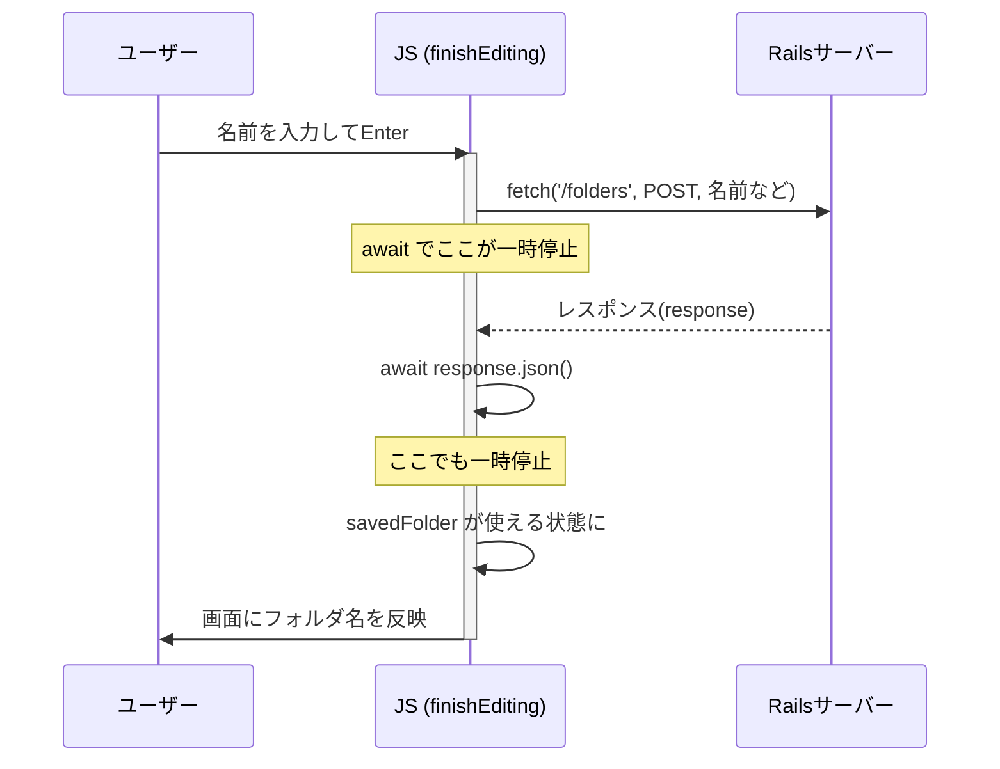

# fetch・async・await 解説(新規フォルダ作成のコードで学ぶ)  260913

`async`/`await`を使ったバージョンの解説。`.then()`版は[fetchの使い方_総括解説.md](../fetchの使い方_総括解説.md)、`Promise`の図解は[Promiseとfetchの図解解説.md](./Promiseとfetchの図解解説.md)を参照(そちらは`.then()`中心で、`async`/`await`自体の解説はしていない)。

---

## 0. お題にするコード

`folder_saving.js`の、メインパネルで新規フォルダを作る処理。

```javascript
async function finishEditing() {
    const newName = nameInput.value || '新規フォルダ';
    const csrfToken = document.querySelector('meta[name="csrf-token"]').content

    const response = await fetch('/folders', {
        method: 'POST',
        headers: {
            'Content-Type': 'application/json',
            'X-CSRF-Token': csrfToken,
        },
        body: JSON.stringify({
            folder: {
                name: newName,
                color: randomColor,
            },
        }),
    });
    const savedFolder = await response.json();

    new_folder.dataset.folderId = savedFolder.id;

    const nameSpan = document.createElement('span');
    nameSpan.classList.add('folder-name');
    nameSpan.textContent = savedFolder.name;
    if (nameInput.parentNode) new_folder.replaceChild(nameSpan, nameInput);
}
```

---

## 1. まず全体像: このコードは何をしてるか

具体的な操作から始める。

1. ユーザーが「+」→「フォルダ」を押す
2. その場に、名前を入力できる入力欄が出る(まだサーバーには何も送っていない、見た目だけの状態)
3. 名前を入力して、Enterを押すかフォーカスを外す
4. `finishEditing()`が呼ばれる ← **ここからが今回のお題**
5. 入力した名前を、サーバー(Rails)に送って保存してもらう
6. 保存が終わったら、返ってきた情報(確定した名前・id)を使って、入力欄を普通の文字表示に戻す

`finishEditing()`の中身は、5と6をやっている。5(サーバーとの通信)には`fetch`、6(通信が終わるのを待ってから次に進む)には`async`/`await`が使われている。

---

## 2. `fetch`とは何か

**`fetch`は、ブラウザに最初から用意されている「サーバーに通信を送る」ための機能。**

このコードでの実際の呼び出し方。

```javascript
fetch('/folders', {
    method: 'POST',
    headers: {
        'Content-Type': 'application/json',
        'X-CSRF-Token': csrfToken,
    },
    body: JSON.stringify({
        folder: {
            name: newName,
            color: randomColor,
        },
    }),
});
```

| 部分 | 意味 |
|---|---|
| `'/folders'` | どこに送るか(送り先のURL) |
| `method: 'POST'` | 「新しく作る」という種類のお願いであること |
| `headers` | 荷物に貼る「送り状」のようなもの。今回は「中身はJSON形式です」「これは本物のリクエストです(CSRFトークン)」という2つの情報を貼っている |
| `body` | 実際に送る中身。JSのオブジェクト(`{ folder: { name: ..., color: ... } }`)を、`JSON.stringify()`で文字列に変換して送る |

---

## 3. なぜ「待つ」仕組みが必要なのか

**`fetch`を実行しても、サーバーからの返事はすぐには返ってこない。** ネット経由の通信には、必ず時間がかかる(数十ミリ秒〜、回線が悪ければもっと)。

もし「待つ」仕組みが無かったら、どうなるか。想像してみる。

```javascript
// もし await が無かったら…(動かないイメージ)
const response = fetch('/folders', {...}); // 送っただけで、次の行にすぐ進んでしまう
const savedFolder = response.json(); // ← まだ返事が来てないのに、中身を取り出そうとしてしまう
new_folder.dataset.folderId = savedFolder.id; // ← savedFolderが空っぽなので、idが取れない
```

サーバーからの返事が届くのは、コードが上から下に実行された「後」。実行のスピードに対して、返事が届くまでの時間差がある。この時間差を埋めて、「返事が届くまで、ちゃんと待ってから次に進む」ようにするのが、`async`/`await`の役目。

---

## 4. `async`/`await`とは

**`await`**: 「ここで一旦立ち止まって、右側の処理(通信など、時間がかかるもの)が終わるまで待つ」という意味。

```javascript
const response = await fetch('/folders', {...});
```

これは「`fetch(...)`が終わる(サーバーから返事が届く)まで待ってから、その結果を`response`に入れる」という意味になる。

**`async`**: `await`を使うためだけに必要な、関数の宣言。**`await`は、`async`が付いた関数の中でしか使えない。**

```javascript
async function finishEditing() {
    // この中でだけ await が使える
}
```

セットで覚えるのが良い: 「時間のかかる処理を待ちたい関数には`async`を付ける、待ちたい場所に`await`を置く」。

---

## 5. お題のコードを1行ずつ追う

```javascript
async function finishEditing() {
```
→ この関数の中で`await`を使うための宣言。

```javascript
    const response = await fetch('/folders', { method: 'POST', ... });
```
→ サーバーに「フォルダを1個作って」とお願いを送る。**ここで一旦停止し、サーバーから返事が届くまで待つ。** 届いたら、その返事(レスポンス)を`response`に入れて、次の行に進む。

```javascript
    const savedFolder = await response.json();
```
→ `response`(サーバーからの返事)は、まだJSON形式の文字列のままなので、JSで扱えるオブジェクトの形に変換する。これにも実は少し時間がかかるので、ここでも`await`で待つ。変換が終わったオブジェクトを`savedFolder`に入れる。

```javascript
    new_folder.dataset.folderId = savedFolder.id;
    const nameSpan = document.createElement('span');
    nameSpan.classList.add('folder-name');
    nameSpan.textContent = savedFolder.name;
    if (nameInput.parentNode) new_folder.replaceChild(nameSpan, nameInput);
```
→ ここに来る時点で、`savedFolder`には確実に中身(`id`・`name`)が入っていることが保証されている。なので安心して`savedFolder.id`や`savedFolder.name`を使い、画面の入力欄を、確定した名前の表示に置き換える。

---

## 6. 図解: 時間の流れ

### タイムラインで見る

```
時間 ─────────────────────────────────────────────▶

[ユーザー]
  Enterを押す
     │
     ▼
[finishEditing() 開始]
     │
     ▼
  fetch('/folders', ...) を実行
     │
     │ ◀── ここで await により一時停止
     │      (この間、ページの他の部分は固まらず、普通に動き続けている)
     │
     ▼
  (…通信中…Railsが処理中…)
     │
     ▼
  サーバーから response が届く ── ここで一時停止が解除され、続きが動き出す
     │
     ▼
  await response.json() を実行 ── ここでもう一度、一時停止
     │
     ▼
  savedFolder が使える状態になる ── 一時停止が解除される
     │
     ▼
  画面にフォルダ名を反映して、finishEditing() 終了
```

### シーケンス図



**重要なポイント**: `await`で止まっている間、止まっているのは**この関数(`finishEditing`)の中だけ**。ページ全体が固まってしまうわけではなく、ユーザーは他のボタンを押したりできる。`await`は「関数の中の、この先の行」だけを一時停止させる仕組み。

---

## まとめ

| 用語 | 一言でいうと |
|---|---|
| `fetch` | サーバーに通信を送る、ブラウザ標準の機能。送った直後に返事はまだ手に入らない |
| `await` | 「右側の処理が終わるまで、ここで待つ」という合図。時間のかかる処理(`fetch`など)の前に置く |
| `async` | `await`を使うために、関数に付けておく必要がある宣言 |

このお題のコードでは、`await`が2回登場する(`fetch`の完了を待つ・`response.json()`の完了を待つ)。どちらも「サーバー側とのやり取りには時間がかかるので、結果が揃うまで待ってから、次の処理(画面の更新)に進む」という同じ目的のために使われている。
