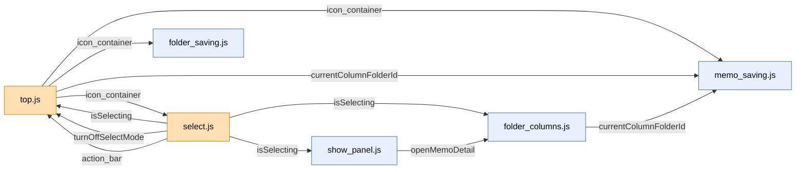

# JSファイル構成、役割と関係図  260909

`app/javascript/`にある8個のJSファイルについて、それぞれの役割と、ファイル同士がどうやり取りしているかをまとめます。

「そもそもなぜファイルをまたいで変数が使えないのか」「`window`とは何か」という仕組み自体は、[JSファイル間での変数.md](./JSファイル間での変数.md)で解説済みなので、ここでは扱いません。ここでは「実際にこのアプリの8ファイルが、具体的に何を、誰から誰に渡してるか」だけに絞ります。

---

## 1. 読み込まれる順番

`application.js`が全部のエントリーポイントで、この中に書かれた順番で各ファイルが読み込まれます。

```javascript
// application.js
import "top"            // ①
import "select"         // ②
import "memo_saving"    // ③
import "show_panel"     // ④
import "folder_saving"  // ⑤
import "folder_columns" // ⑥
```

この順番が大事な理由は後述します(4章)。

---

## 2. 各ファイルの役割

| ファイル | 担当していること |
|---|---|
| `window.js` | 各ファイルからよく使うDOM要素をまとめて取得する`getRefs()`関数を提供する(ロジックは持たない、道具箱) |
| `top.js` | メインパネルの開閉、BGM再生開始、メインパネル内のフォルダ/メモの名前変更(保存込み) |
| `select.js` | 選択モード(チェックボックスを出して、まとめて削除・コピーする機能) |
| `memo_saving.js` | 新規メモの保存(`POST /memos`) |
| `show_panel.js` | メモの詳細表示・編集・保存(`PATCH /memos/:id`)・閉じる |
| `folder_saving.js` | メインパネルでの新規フォルダの作成(`POST /folders`) |
| `folder_columns.js` | フォルダの無限カラム表示、カラム内でのフォルダ新規作成・名前変更 |

---

## 3. ファイルをまたいだやり取り: `window`に置かれてるもの一覧

複数のファイルが関わる処理は、すべて`window`を経由してやり取りしています。今この時点で`window`に置かれてるものは、以下の6つです。

| `window`上の名前 | 中身 | 置く側(誰が用意するか) | 使う側(誰が読むか) | 目的 |
|---|---|---|---|---|
| `icon_container` | DOM要素 | `top.js` | `folder_saving.js`, `memo_saving.js`, `select.js` | メインパネルのアイコン置き場を配る |
| `isSelecting` | true/false | `select.js` | `top.js`, `folder_columns.js`, `show_panel.js` | 今、選択モード中かどうかの共通フラグ |
| `turnOffSelectMode` | 関数 | `select.js` | `top.js` | 選択モードをまとめて解除する処理を配る |
| `action_bar` | DOM要素 | `select.js` | `top.js` | 「移動/コピー/削除/共有」バーの入れ物を配る |
| `currentColumnFolderId` | id文字列 or `null` | `top.js`(初期化・リセット)、`folder_columns.js`(セット) | `memo_saving.js` | 今作ってるメモが、どのフォルダの中身として保存されるか |
| `openMemoDetail` | 関数 | `show_panel.js` | `folder_columns.js` | カラムの中のメモアイコンをクリックした時に、詳細パネルを開く処理を配る |

---

## 4. 図解: 誰が誰に何を渡してるか

### 俯瞰図(Mermaid)

箱と線で見たい場合はこちら。オレンジの箱(`top.js`・`select.js`)が、お互いを必要としてる「双方向」の2つです。GitHubやVSCode(Mermaid対応のプレビュー)で開くと、実際に線で繋がった図として表示されます。



もしエディタでこの図が線として表示されず、コードの文字列のまま見えてる場合は、Mermaidに対応したプレビュー機能(拡張機能など)が無いだけです。その場合は下のテキスト版(矢印の一覧)を参照してください。内容は同じです。

### テキスト版(矢印の一覧)

矢印は「左のファイルが、window経由で右のファイルに渡してるもの」を表します。

```
top.js  ──── icon_container ────────────▶  folder_saving.js
top.js  ──── icon_container ────────────▶  memo_saving.js
top.js  ──── icon_container ────────────▶  select.js

select.js ─── isSelecting ──────────────▶  top.js
select.js ─── isSelecting ──────────────▶  folder_columns.js
select.js ─── isSelecting ──────────────▶  show_panel.js
select.js ─── turnOffSelectMode ────────▶  top.js
select.js ─── action_bar ───────────────▶  top.js

top.js ─────── currentColumnFolderId ───▶  memo_saving.js
folder_columns.js ── currentColumnFolderId ▶ memo_saving.js

show_panel.js ── openMemoDetail ────────▶  folder_columns.js
```

### 1点だけ注目してほしいところ

`top.js`と`select.js`は、お互いがお互いの共有物を使い合う関係になっています。

- `top.js`が`window.icon_container`を用意して、`select.js`がそれを使う
- `select.js`が`window.isSelecting`・`window.turnOffSelectMode`・`window.action_bar`を用意して、`top.js`がそれを使う

一方通行ではなく、この2ファイルだけ「双方向」でやり取りしてるのが、この8ファイルの中では少し特殊な点です。

---

## 5. 具体例で1つ追ってみる: カラムの中のメモをクリックした時

「役割」と「window一覧」だけだと抽象的なので、実際に1回のクリックがファイルをまたぐ様子を追います。

**場面**: メインパネルから開いたカラムの中に、メモのアイコンがある。それをクリックする。

1. クリックを検知するのは`folder_columns.js`(カラムの中身を作った張本人なので、クリックの監視もここが担当)
2. クリックされたのがメモだと分かったら、`folder_columns.js`は自分では詳細パネルを開く処理を持っていないので、`window.openMemoDetail(id)`を呼ぶ
3. この`openMemoDetail`という関数の中身は、実は`show_panel.js`が用意したもの([show_panel.js:18](../app/javascript/show_panel.js#L18)の`window.openMemoDetail = function (memoId) {...}`)
4. 呼ばれた`openMemoDetail`が、サーバーにそのメモの中身を取りに行き、詳細パネルを表示する

```
[folder_columns.js]                [show_panel.js]
  メモアイコンをクリック
        │
        ▼
  window.openMemoDetail(id) ────▶  openMemoDetailの中身が実行される
                                          │
                                          ▼
                                  サーバーからメモを取得 → パネル表示
```

「カラムを作る係」と「メモの詳細を表示する係」は別ファイルなのに、`window`に関数を1個置いておくことで、まるで1つの処理のようにつながっています。

---

## まとめ

- ファイルは1つ1つが「1つの機能」だけを担当するように分かれている(2章の表)
- ファイルをまたぐ必要がある値・処理は、すべて`window`に置いて共有している(3章の表)
- ほとんどの関係は一方通行だが、`top.js`と`select.js`だけは双方向(4章)
- `window`に置かれてるのはDOM要素だけでなく、フラグ(`isSelecting`)や関数(`turnOffSelectMode`、`openMemoDetail`)もある
