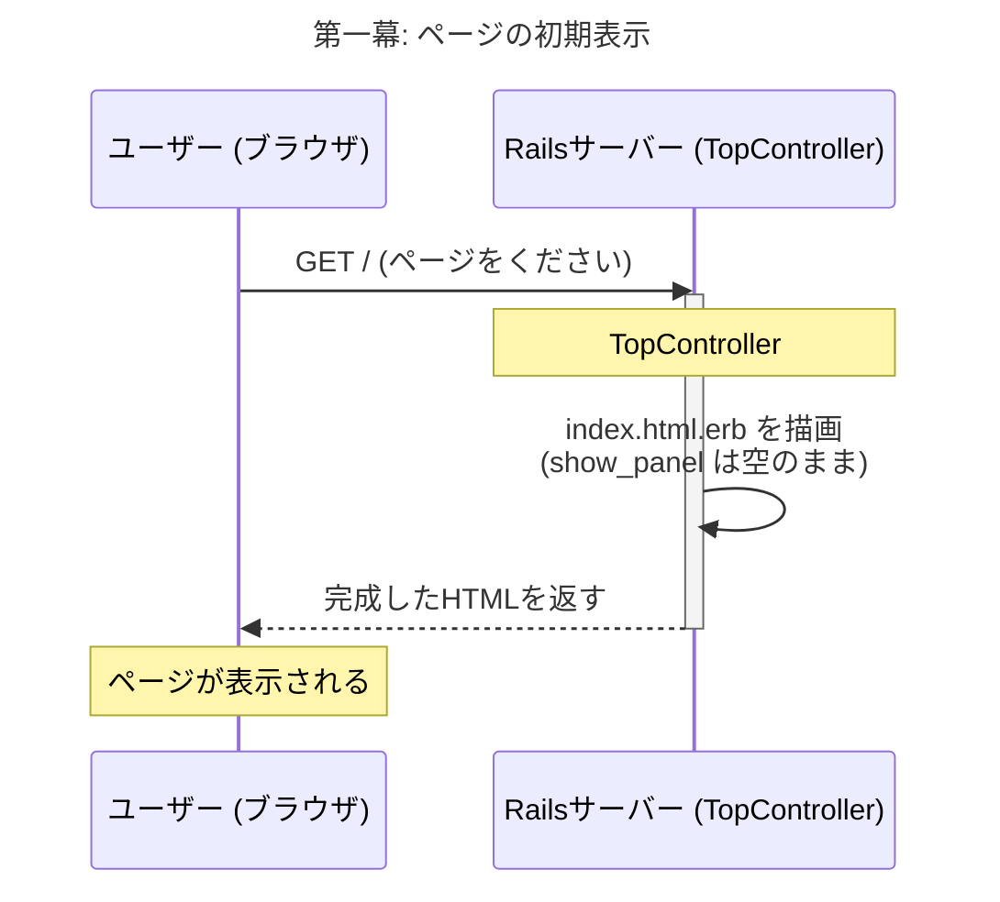
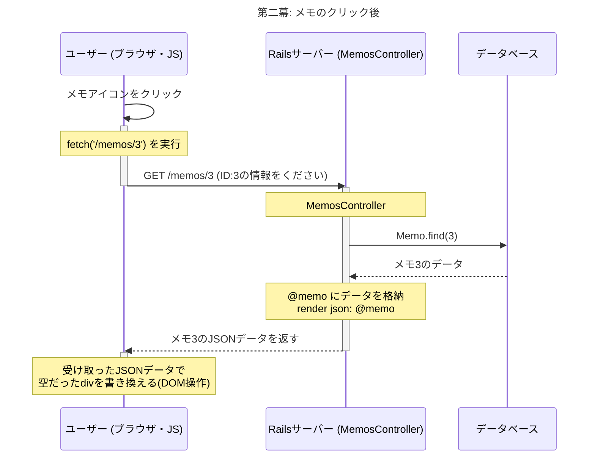

# 【超図解】なぜ@memoが使えないのか？ Rails(サーバー)とJavaScript(ブラウザ)の二幕構成で完全理解する

「`MemosController`に`@memo`があるのに、なぜビューで使えないんだ！」

この疑問は、Web開発の非常に重要な核心に触れています。結論から言うと、**あなたが「同じページ」だと思っているものの中で、実は全く別の2つのイベントが、全く別のタイミングで発生している**からです。

この2つのイベントを、演劇の「第一幕」と「第二幕」に例えて、誰にでも分かるように解説します。

---

## 第一幕：舞台設営 (ページの初期表示)

**登場人物:**
*   **観客:** あなた (ブラウザを操作する人)
*   **舞台監督:** Railsサーバー (`TopController`)

**あらすじ:**
あなたがブラウザでサイトのURL (`/`) にアクセスした瞬間、第一幕の幕が上がります。

1.  **観客が劇場に来る (GET /)**
    *   ブラウザが「ページをください！」とサーバーにリクエストを送ります。

2.  **舞台監督が舞台セットを組む (`TopController#index` → `index.html.erb`)**
    *   リクエストを受け取った舞台監督(Rails)は、`TopController`の`index`メソッドを実行します。
    *   `index`メソッドは、舞台の設計図である`index.html.erb`を元に、HTMLの舞台セットを組み立て始めます。

**【最重要ポイント】**
この時点では、まだ**主役の俳優（どのメモか）は決まっていません。**
観客（あなた）が、これからどのメモのアイコンをクリックするかなんて、舞台監督(Rails)には知る由もありません。

そのため、主役が登場する予定の場所（メモの詳細を表示するパネル）は、**空っぽのまま**にしておくしかありません。これを「プレースホルダー（場所取り）」と呼びます。

```html
<!-- index.html.erb の一部 -->

<!-- ここは「主役が登場する場所」なので、今は空っぽにしておく -->
<div id="main_show_panel">
  ...
  <div class="show_content">
    <div class="show_title"></div> <!-- 空っぽのタイトル欄 -->
    <div class="body"></div>       <!-- 空っぽの本文欄 -->
  </div>
  ...
</div>
```

**なぜここで `@memo` を使うと `nil:NilClass` エラーになるのか？**

`TopController#index` の中では、`@memo`という変数を用意するコードが一行も書かれていません。そのため、`index.html.erb` の中で `@memo` を使おうとしても、中身は `nil` (空っぽ) です。`nil`に対して `.title` を呼び出そうとするので、`undefined method 'title' for nil:NilClass` というエラーが発生するのです。これは完全に正しい動作です。



第一幕は、舞台セットが観客の前に現れたところで終了です。

---

## 第二幕：主役登場 (ユーザーのクリック)

**登場人物:**
*   **観客:** あなた
*   **舞台係:** JavaScript (`show_panel.js`)
*   **楽屋係:** Railsサーバー (`MemosController`)

**あらすじ:**
無事に表示されたページで、あなたが特定のメモのアイコンをクリックした瞬間、第二幕の幕が上がります。ここからの主役はJavaScriptです。

1.  **観客が主役を指名する (メモアイコンをクリック)**
    *   `addEventListener`によって、クリックが検知されます。

2.  **舞台係が楽屋に問い合わせる (`fetch('/memos/3')`)**
    *   舞台係(JavaScript)は「IDが3番の俳優さんを舞台に上げてください！」と、楽屋係(Rails)に**新しいリクエスト**を送ります。
    *   これが `fetch` の正体です。第一幕とは**全く別の、独立した通信**です。

3.  **楽屋係が主役の情報を渡す (`MemosController#show`)**
    *   リクエストを受け取った楽屋係(Rails)は、`MemosController`の`show`メソッドを実行します。
    *   **ここで初めて `@memo = Memo.find(3)` が実行されます。**
    *   楽屋係は、見つけ出した俳優の情報（メモのタイトルや本文）を、舞台係が扱いやすい形式（JSON）で返します。(`render json: @memo`)

4.  **舞台係が主役を舞台に立たせる (DOM操作)**
    *   俳優の情報(JSON)を受け取った舞台係(JavaScript)は、第一幕で作られた**空っぽの舞台セット**（`.show_title` と `.body`）に、その情報を書き込みます。
    *   `show_title.textContent = memo.title;`
    *   `body.textContent = memo.content;`

これでようやく、観客の前に主役（選択したメモの内容）が登場します。



---

## 結論：なぜあなたのコードは動かなかったのか

あなたの混乱の原因は、**第一幕の舞台セット（`index.html.erb`）を組み立てている最中に、第二幕でしか登場しない主役（`@memo`）を無理やり舞台に上げようとしていた**からです。

*   **`memo.id.title`:** そもそも構文が違います。`memo.title`が正しいです。
*   **`memo` (ループなし):** 第一幕の設計図に、俳優の個人名(`memo`)を書いても、まだ誰もいません。
*   **`@memo`:** 第一幕の舞台監督(`TopController`)は、主役(`@memo`)のことを知りません。主役のことを知っているのは、第二幕に登場する別の楽屋係(`MemosController`)だけです。

### 正しい役割分担

*   **Railsのビュー (`index.html.erb`)**: ページを開いた時点では、中身が**空っぽの器**を用意するだけ。
*   **JavaScript (`show_panel.js`)**: ユーザーが何かをクリックしたら、**別の通信**でサーバーから中身のデータだけをもらってきて、その**空っぽの器に注ぐ**。

この役割分担を理解することが、モダンなWebアプリケーション開発の第一歩です。

ですので、`index.html.erb`の該当箇所は、JavaScriptが後から中身を注ぎ込めるように、**完全に空の器**にしておくのが正解です。

```html
<div class="show_content">
  <div class="show_title"></div>
  <div class="body"></div>
</div>
```