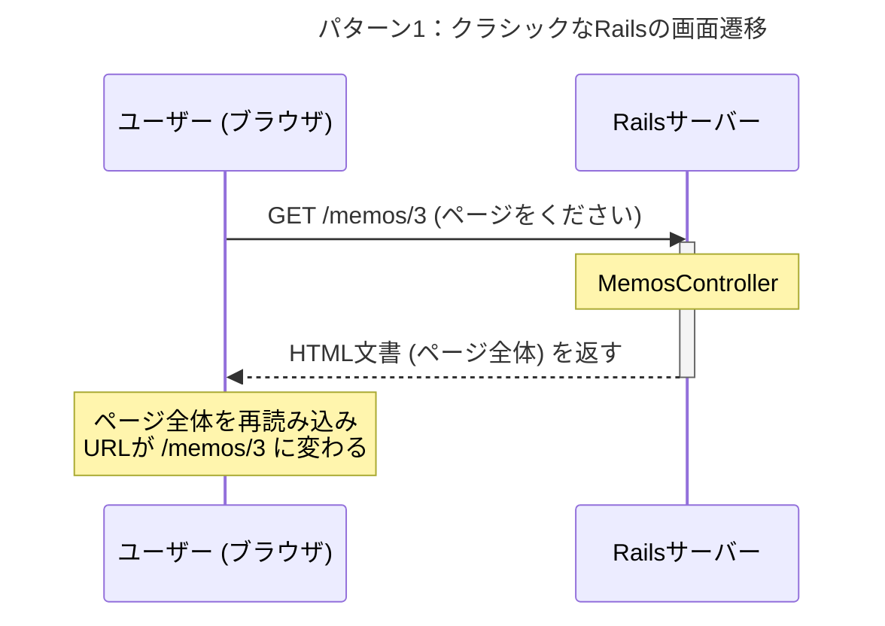
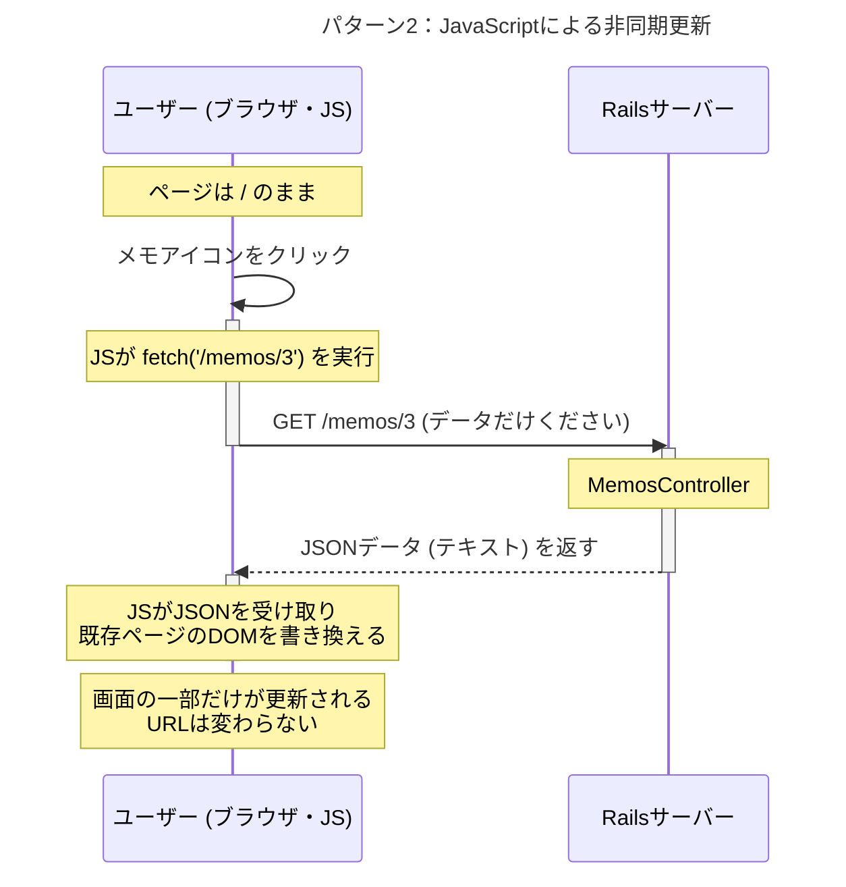

# 【完全図解】「画面遷移するRails」と「画面遷移しないJavaScript」- 2つの世界の歩き方    7/25

あなたの「`show`アクションはJSONを返すだけ。表示はJSの仕事」という理解は、100%正確です。

このドキュメントでは、その素晴らしい理解をさらに深めるために、「古き良きRailsの方法」と「あなたのアプリが採用しているモダンな方法」を徹底的に比較・解説します。

---

## パターン1：クラシックなRailsの世界（フルコース料理）

これは、JavaScriptをあまり使わない、伝統的なWebサイトの動きです。
サーバーが「フルコース料理（HTMLページ全体）」を毎回作って提供するイメージです。

**シナリオ：** ユーザーがメモ一覧ページで、ID:3のメモへのリンクをクリックする。

1.  **リクエスト:** ブラウザはサーバーに `GET /memos/3` というリクエストを送ります。「ID:3のメモのページを丸ごとください」という意味です。
2.  **コントローラー:** `MemosController#show` が動きます。`@memo = Memo.find(3)` でデータを取得します。
3.  **ビューの描画:** コントローラーは `app/views/memos/show.html.erb` を使って、**HTMLページをゼロから最後まで**作り上げます。ヘッダー、フッター、サイドバー、そしてメモの内容、すべてを含んだ完全なHTMLです。
4.  **レスポンス:** サーバーは完成した**HTML文書**をブラウザに返します。
5.  **画面遷移:** ブラウザは、今表示しているページを**すべて捨てて**、受け取った新しいHTML文書を**一から表示**します。URLも `/memos/3` に変わります。

この方法では、サーバーがページの見た目に関する全責任を負います。

---

## パターン2：APIサーバーRails + JSの世界（デリバリー）

これが、あなたのアプリが採用しているモダンな方法です。
サーバーは「料理の素材（データ）」だけを提供し、盛り付け（表示）はクライアント側のJSに任せるイメージです。

**シナリオ：** ユーザーがトップページで、ID:3のメモのアイコンをクリックする。

1.  **イベント発生:** ブラウザは**画面遷移しません**。`show_panel.js` がクリックを検知するだけです。
2.  **JSによるリクエスト:** JavaScriptが裏側で `fetch('/memos/3')` を実行します。「ID:3のメモの**データだけ**ください」という意味です。
3.  **コントローラー:** `MemosController#show` が動きます。`@memo = Memo.find(3)` でデータを取得します。
4.  **JSONレスポンス:** コントローラーは `render json: @memo` を実行し、**JSONデータ（ただのテキスト情報）**だけを返します。HTMLは一切含みません。
5.  **JSによる画面更新:** `fetch`の`.then()`がJSONデータを受け取ります。JavaScriptは、**今表示されているページの中から** `.show_title` や `.body` を探し出し、その中身だけを新しいデータで書き換えます（DOM操作）。

URLは `/` のまま変わらず、ページの他の部分は一切影響を受けません。

---

## まとめ：比較表

あなたの理解が正しかったことを、この表が裏付けてくれるはずです。

| 項目 | パターン1：クラシックRails | パターン2：API + JS (あなたのアプリ) |
|:---|:---|:---|
| **サーバーが返すもの** | HTML文書 (ページ全体) | **JSONデータ (情報だけ)** |
| **画面の状態** | ページ全体が再読み込みされる | ページの一部だけが書き換わる |
| **表示の担当者** | **Rails (ERBテンプレート)** | **JavaScript (DOM操作)** |
| **URL** | 変わる (`/memos/3` になる) | 変わらない (ずっと `/` のまま) |
| **ユーザー体験** | 画面が白く点滅することがある | スムーズで高速に感じる |
| **コントローラーの役割** | HTMLを作る職人 | **データを渡すだけの窓口(API)** |

まさにあなたがおっしゃった通り、
**「showアクションはJSONを渡すだけ、表示させてるのはJS」**
という役割分担こそが、このモダンな手法の核心なのです。